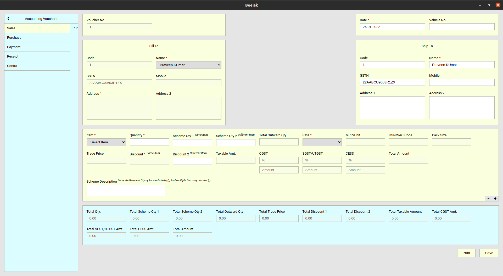

# BEEJAK
A cross-platform desktop application for a wholesale business to manage inventory and generate various types of reports. It was built using ElectronJS and a MySql database. Sequelize ORM was used to perform SQL queries and track database versions.

## Preview

